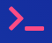

# Carlie Hamilton's Portfolio

- Deployed Website - [carlie.netlify.com](https://carliehamilton.netlify.com/) or [carliehamilton.com](http://carliehamilton.com)
- [Github Profile](https://github.com/BlueCodeThree/Carlie-Portfolio)

## ℹ️ About This Website

### Purpose

CarlieHamilton.com is my professional portfolio, designed to showcase:
- My programming skills through linking personal and professional projects - with the aim of attracting employers
- Record previous and upcoming speaking engagements and written articles - to increase my social proof, as well as to serve as a hub for people to access my writing and speaking records.
- Information about me, and as a way for people to find how to contact me.

### Functionality & Features

This website was built as a one page website. It was designed with the mobile layout first.

#### Navigation
Mobile navigation is through a hamburger style menu - when you click on the three lined "hamburger" it changes to a symbol of a food hamburger, just for a bit of fun. When the menu opens it looks like it is coming from behind and folding down. I thought this was a little different from usual navigation animations. The menu is fixed to the top of the screen so that you do not have to scroll to access a different part of the site.

The mobile and tablet layouts of the website are single column style, with the main difference being that the tablet view has the same menu as the desktop style.

The desktop and table menu is missing from the header (splash page) of the site, but once you scroll down it becomes fixed (sticky) to the top of the page - again so you do not have to scroll to access the different parts of the website.

The website also has smooth scrolling when it navigates between sections.

#### Header

The header has a shaky button to go to the main section of the site. I wanted to do this to grab people's attention to hopefully want to see more of the website.

#### About

The about section is an introduction about me, and display my tech stack of technologies that I know and use. In the future as this tech stack grows I intend to divide it more into front and back end technologies. In the future I would also expand this section to include a work history, or perhaps create a new section.

I highlighted some of the text in order to break it up, make it more readable, and to highlight some important parts of the text.

#### Projects

The projects section features four of my latest projects, with an image (if possible, a fun gif to capture interest), a bit about the project, and a link to the github for the project. If the project had a way for the visitor to view it live (such as a website or app) - I would add a link to it here as well.

The link to my github, at the bottom of this section, has a subtle side-to-side animation, to draw attention to it without it being too distracting.

#### Speaking

The speaking section of this website features links to past presentations, and to any future presentations.

#### Writing

Similar to the speaking section, the writing section will showcase selected writings.

#### Contact and Footer

The contact section has a working form that uses [UseBasin.com](https://usebasin.com/) to handle the back end.

There are links to my social media, and a link back to the top of the page.

#### Terminal Icon

The terminal icon is used as a logo on the website. If you hover over these, they will change into another icon. This icon is also used as a favicon.

#### Shhhhhh...

There may be a secret message for you if you use dev tools or look at the source code... It's not very exciting 😄

### Sitemap

The website is all on one page, and I have designed it so that the menu is always in view, so that you can navigate to where you want to go without having to scroll or swipe anywhere first.

The main sections are:

- Home (header)
- About
- Projects
- Speaking
- Writing
- Contact (and footer section)

### Screenshots
### Target audience
- Possible employers
- Fellow peers
- Meetup, conference and event organisers

### Tech stack (e.g. html, css, deployment platform, etc)

The website was designed with html, scss (using flexbox and grid), and javascript.

For the purposes of assessment, the website has been deployed on [netlify](http://carlie.netlify.com), but it's permanent home at the moment is on SiteGround at [CarlieHamilton.com](http://carliehamilton.com)

## 🖌 Design

### Design process

- Brainstorm
- Moodboard
- Wireframes
- Considered a Logo
- Built the html according the the wireframes
- Added SCSS to style. Experimented with different animations to try and make the website unique.
- Tested and deployed as it was built. At the end, also tested on additional browsers.
- Also asked for feedback at various stages from a variety of sources.
- Tested for accessability.
- Testing of links and final deployment (for now).

### Initial Ideas

My initial ideas for the website were:

- One column design - desktop mode possibly having a sidebar navigation
- One page design for the most part, but with a link to show more projects (all projects to be on a separate page).
- Navy blue background, with hot pink highlights/accents on the page.
- The overall website having a professional feel but also unique and stand out with the colour pallet.

I am influenced by the structure of [Matthew William's website](http://findmatthew.com/)

I also really like the idea of incorporating a game on the page like on [Rafael Caferati's website](https://caferati.me/)

On his page he has some kind of space craft/robot that can shoot things to destroy the page. I know it is an extra extra stretch goal, but I would love to try to convert my ruby snake game to javascript and have that eat my main page. This is a super stretch goal to implement in the future.

#### Mood Board

I chose navy blue because it is my favourite colour and hot pink because that is the colour of my jumper. I like to stand out in photos with my bright hot pink jumper, it has become a bit of a signature colour for me.

Because pink is a really bright colour, I thought it would be better in small doses. I added a green colour incase I needed it, and an offwhite colour as well.

I wanted sans serif fonts for easy readability on the screen. I wanted a mono space font for special highlighting, maybe for image captions. I chose two other sans serif fonts for headers and general text. As I implemented the page, I didn't think the Oxygen font looked quite right, so instead replaced it with "Muli". The mono-space font ended up not being needed.

### Wireframes

Original Wire Frames:

In my wireframes I have created a layout for mobile as well as a larger version for desktop and tablet. Originally I had an almost one page design with a separate page to expand on my portfolio items.

As the page was designed, the social media icons were removed from the top navigation (of the desktop version), and instead were placed in the header section.

Originally, the projects section was to be a preview that then expanded into a page of their own. I decided it would be more cohesive to keep them on the one page. I also planned to have each project be displayed in a box horizontally with the image to the left and the information to the right (in desktop view). When designing, however, I felt like there was too much white space. So, instead, I kept the projects laid out vertically, like on the mobile version, and instead divided them in to two columns.

Another change from the wireframes was the originally I was to have explicit boxes around my content. As the website was being built it became clear that the explicit boxes looked off, and instead the content boxes are the same background as the rest of their section.

### Logo

I wanted a simple logo/image to put on the website that would represent being a developer, and allow the page to have a common element that I could also use as a favicon. I decided to use a terminal prompt for my logo.

### Usability considerations

- I wanted the user to be able to access the navigation from any part of the website - I felt that as a one page website this was important. So I created a menu that is always at the top in both mobile and bigger screen versions.

- The colours of my website are very bold. This presented some problems with accessability. I originally had another blue colour on the website, but when testing it with my colours it provided little contrast. Instead, I decided to go for a darker blue (but still lighter than my main navy blue) as a contrasting background and the website was better for it.

The next issue I had with colour contrast was my main menu, and my highlighted text, where I was using my main pink colour and off white text. They did not pass at all. As I considered what to do, I continued to design my website, and when I asked for feedback it was confirmed that it was hard to read for some people.

I was reluctant to get rid of the bright pink colour because I felt like it tied the site together well, and was happy to discover it not only looked good with my dark navy colour as text, it also passed all but WCAG AAA rating for normal text.

I hope this is an improvement for people who have trouble viewing certain colours. In the future, I will design a black and white portfolio!

- I have included alt tags and title tags throughout my website with the aim to make it more accessible to those who use screen readers.

- Links and the contact form are accessible via using the keyboard only.

- The website was tested OK in Chrome & Firefox (desktop), Chrome on a mobile phone, Silk browser on a tablet. It was also tested in Edge, Safari (mobile) and Windows Phone through an [emulator - browserstack.com](https://www.browserstack.com/).

Some browsers display the menu already stuck to the top in desktop mode, it displays as fixed rather than sticky, but this does not affect the functionality of the site.

- I made sure it performed well on Google's lighthouse audit

## 🔍 Planning
### Project plan & timeline

#### Pre Project

- mood boarding and wire frame brain storming, trello board setup

#### Day One - Tuesday, 14 May 2019

I completed my mood board and wire frames and began working on my content and HTML. I have a functional hamburger menu for the moment.

I am already thinking that I will be changing slightly from my wireframes for the mobile. Instead of the content inside boxes, having the content go across 100% of the screen and change the background colours of each slighty. I am undecided on the colours, if I want to do slightly different blue colours (similar colours), or have the colours contrasting.

End of day trello board:

#### Day Two - Wednesday 15 May 2019

On day two I finished the most of the mobile layout, added a css animation to my main button, and made the main navigation work in desktop/tablet mode.

#### Weekend

I continued to work on my website. I have changed my secondary blue colour so that it is more accessible, and have decided to put the whole website on one page instead of a seperate page for my projects. This way the webpage will also be easier to update and maintain.

#### Monday 20 May 2019

I finalised my layout for the contact section of the website.

#### Tuesday 21 May 2019

I attempted to add some css animations to my main navigation menu, but had troubles. If I added a transition to the menu in mobile mode, I couldn't "reset" it for the desktop mode. And when I tried to add a transition to my menu in tablet/desktop mode, I couldn't style it.

## 🕸 Short Answer Q&A
 - Include short answers to the following questions,
 - Describe key events in the development of the internet from the 1980s to today (max. 150 words)
 - Define and describes the relationship between fundamental aspects of the internet such as: domains, web servers, DNS, and web browsers (max. 150 words)
 - Reflect on one aspect of the development of internet technologies and how it has contributed to the world today (max. 150 words)
